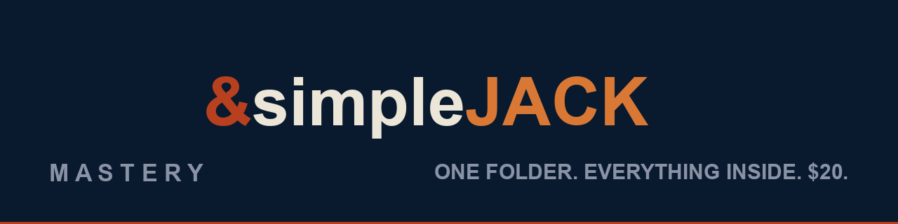

<div align="center">



**A complete AI workstation in one folder. No install. No subscription. No phone-home.**

[Buy — $20 USD](SALE.md) · [Setup Guide](README.txt) · [Support the Work](SUPPORT.md) · [Contact](#contact)

</div>

---

## What is this?

SimpleJack is a **portable, offline-first AI workstation for Windows**. One folder holds everything — the brain, the model hub, the voice, the skills, an embedded Python runtime. Copy it to any PC, double-click, and it runs. Delete the folder, and the machine is exactly as it was. **Zero residue.**

It was built by a controls specialist who could no longer read screens — so every part of it talks, narrates, and can be watched instead of read. Accessibility isn't bolted on. It's the chassis.

## What's in the box

| Layer | What it does |
|---|---|
| 🧠 **Brain** (`simplejack.py`) | Local agent runtime — conversation, tools, rolling memory, self-repair |
| 🎛️ **Model Hub** (`modelhub/`) | Model card router: local models + free-tier cloud cards, switchable live |
| 🗣️ **Voice** (`morPHYtrek.py`) | Narrates everything the assistant does — local TTS, no cloud |
| ⚡ **RSVP reader** | Watch the model *think* — reasoning streams word-by-word, zero eye movement |
| 🛠️ **Skills** (`SKILLS/`) | 100+ purpose-built tools: browser automation, file ops, X scanner… |
| 🐍 **Runtime** (`runtime/`) | Embedded Python — nothing to install, nothing to break |

## Quick start

```
1. Unzip anywhere
2. Double-click INSTALL.bat        (one time, fetches the engine)
3. Double-click STARTSIMPLEJACK.bat (every day — this is the product)
```

That's it. Your browser opens SimpleJack and you're talking to a fully-local AI.

**Want free cloud models too?** Open the Model Hub → GET ACCESS KEY → **"Continue with Google"** → copy the key → paste. Three minutes, zero cost, spelled out step-by-step in the [Setup Guide](README.txt).

## Why it exists

- **Every "free" AI tool gets paywalled eventually.** This one can't — you own the folder.
- **Subscription rent on your own hardware is a tax.** This pays once.
- **If the company disappears, your copy keeps working.** That's the point.

## Buy

| | Price |
|---|---|
| **SimpleJack — Personal** | **$20 USD, one time** |
| Trades/Training · Site licenses | [Contact](SUPPORT.md) |

e-Transfer (Canada) or **Bitcoin Lightning** (worldwide) — no middlemen, no Stripe. → **[SALE.md](SALE.md)**

## Also from MorPHYes Mastery

- **[MorPHYes RSVP](https://github.com/morphyesmastery/morphyes-rsvp)** — reasoning you can READ, live inside the Hermes desktop app. MIT, free.


## Contact

- **Issues** — bug reports and feature requests: [open an issue](https://github.com/morphyesmastery/simpleJACK/issues)
- **Discussions** — questions, setup help, show-and-tell: [join the discussion](https://github.com/morphyesmastery/simpleJACK/discussions)
- **Email** — trent@morphyesmastery.com

---

<div align="center">

**WE WORK HERE.**

Built in Calgary by [MorPHYes Mastery](https://github.com/morphyesmastery) — human sovereignty over technology.

</div>
